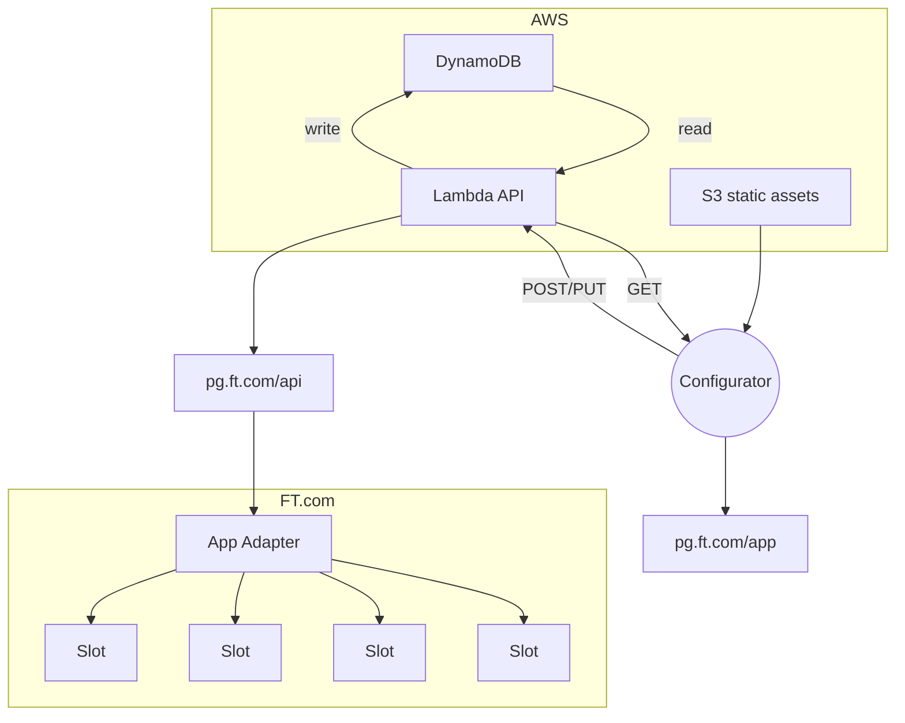

# PG: Configurator

## Introduction
An app to mange the configuration of Project Gwyneth-powered ads

This PoC uses the [Architect](https://arc.codes) framework to scaffold resources
and deploy a serverless app to AWS. Technologies used include Lambda,
DynamoDB, API Gateway and S3.

## Architecture

## Development

- In a terminal window, run `npm run dev:api`
- In another terminal window, run `npm run dev:app`

The app will be available at `http://local.ft.com:3000`, reading data from `http://localhost:3333`

## Deployment

- Run `npm run deploy` to build `/app` and deploy assets and infra to AWS
