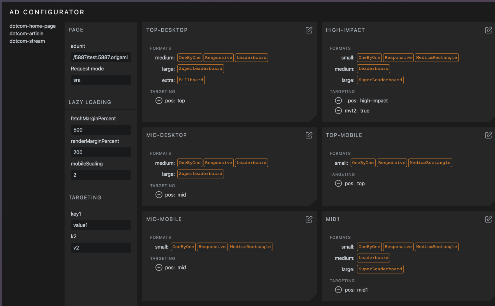
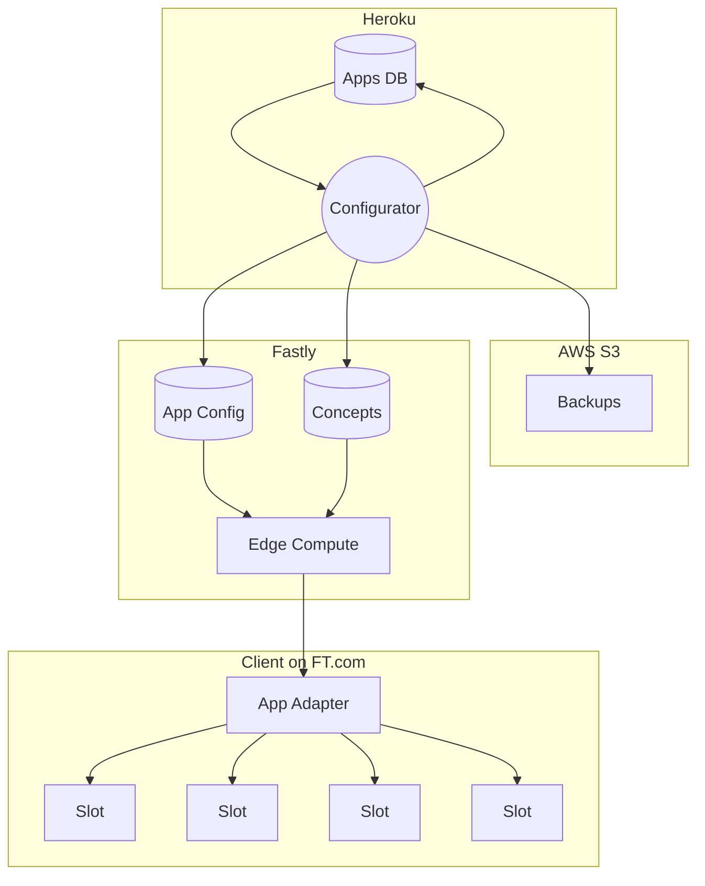

## Introduction



The Configurator is an application that provides non-developers with a friendly UI for managing Page and Slot-level configuration

It reads and writes source data to the Apps DB, and writes optimised data (ie requiring no processing by the client) to the `App Config` and `Concepts` Edge Dictionaries read by the App Adapter.

## Architecture



## Developing

```bash
npm run dev
```

## Building

To create a production version of your app:

```bash
npm run build
```

You can preview the production build with `npm run preview`.
